<p align="center"></p>

# wiki-vs-rag

**Head-to-head benchmark: RAG vs Karpathy-style LLM Wiki Knowledge Compilation.**

> "I built production RAG. Then when Karpathy said RAG is dead, I didn't just follow the hype — I benchmarked both paradigms rigorously."

## The Premise

Two paradigms for LLM knowledge management are competing:

| | RAG (Retrieval-Augmented Generation) | Wiki Compilation (Karpathy Method) |
|---|---|---|
| **Storage** | Vector DB (embeddings, opaque) | Markdown files (human-readable) |
| **Retrieval** | Stateless, re-derived each query | Persistent, compiled once |
| **Auditability** | Low (embedding space) | High (traceable wikilinks) |
| **Self-improvement** | None; must re-index | Self-healing via lint passes |
| **Build cost** | Cheap (embed & store) | Expensive (LLM compiles wiki) |
| **Query cost** | Expensive (retrieve + generate) | Cheap (select pages + generate) |

**This project answers:** Which one actually wins, and when?

## Architecture

```
┌─────────────────────────────────────────────────┐
│                  Benchmark Harness               │
│  Same questions → Both systems → Compare results │
├────────────────────┬────────────────────────────┤
│   Wiki Agent       │        RAG Agent            │
│   (built here)     │     (via A2A protocol       │
│                    │      to rag-a2a)            │
│  ingest → compile  │  chunk → embed → retrieve   │
│  → lint → query    │  → generate                 │
├────────────────────┴────────────────────────────┤
│              Shared Corpus                       │
│  technical/ narrative/ multi-doc/ evolving/      │
├─────────────────────────────────────────────────┤
│              Evaluation Metrics                  │
│  RAGAS │ LLM-as-Judge │ Cost │ Latency │ Audit  │
└─────────────────────────────────────────────────┘
```

## Quick Start

```bash
# Prerequisites: Bun ≥1.0, Docker (for Qdrant/rag-a2a)
bun install

# 1. Ingest corpus into wiki agent
bun run ingest -- --dir corpus/

# 2. Lint the compiled wiki
bun run lint:wiki

# 3. Run head-to-head benchmark
bun run benchmark

# 4. View results
bun run benchmark:report
```

## Wiki Agent Pipeline

### Ingest (raw → wiki)
```
corpus/ → loader → extractor → compiler → wiki/
                                          ├── index.md
                                          ├── log.md (append-only activity log)
                                          ├── sources/
                                          ├── entities/
                                          ├── concepts/
                                          └── syntheses/
```

Following Karpathy's exact methodology:
- YAML frontmatter with `source_count` and `status` (draft|reviewed|needs_update)
- `[Source: filename.md]` inline citations for every claim
- `> CONTRADICTION:` flags when new data conflicts with existing wiki content
- Append-only `log.md` for all operations

### Lint (self-healing)
- **Structural:** orphans, broken links, missing frontmatter, stale pages
- **Uncited claims:** pages without source attribution
- **Missing cross-references:** related pages that should link to each other
- **Semantic:** contradictions, data gaps (LLM-powered)

### Query (answer with citations)
```
question → router (index scan) → select pages → synthesizer → answer with [[citations]]
                                                             → file back as syntheses/ page
```

Query answers are optionally filed back into `syntheses/` — the compounding loop that makes
the wiki grow smarter with use.

## Benchmark Dimensions

| Dimension | Metric | Expected Winner |
|-----------|--------|-----------------|
| Single-hop factoid | Precision@K | RAG |
| Multi-hop reasoning | Accuracy | Wiki |
| Answer quality | Faithfulness | Tie |
| Cost per query | $/query | Wiki |
| Build cost | $/corpus | RAG |
| Latency | p95 ms | RAG |
| Auditability | Citation trace | Wiki |
| Staleness handling | Post-update accuracy | TBD |

## A2A Protocol

Both systems expose A2A interfaces:
- Wiki agent: `localhost:3838/.well-known/agent-card.json`
- RAG agent: `localhost:3737/.well-known/agent-card.json` (rag-a2a)

## Tech Stack

| Component | Technology |
|-----------|-----------|
| Runtime | Bun (TypeScript) |
| LLM | OpenAI (gpt-4o-mini compile, gpt-4o judge) |
| Wiki search | FTS5 (SQLite) |
| RAG integration | A2A protocol → rag-a2a |
| Evaluation | RAGAS + LLM-as-Judge |
| Testing | Bun test + Playwright |

## Known Limitations (Karpathy Method)

Per Karpathy's own analysis, the wiki compilation approach has inherent trade-offs:

| Limitation | Impact |
|-----------|--------|
| Context ceiling | ~400K words practical limit for total wiki size |
| Error compounding | LLM compilation errors propagate across interlinked pages |
| Hallucination risk | Compiled pages may contain LLM-fabricated claims |
| Cost per source | $2-5 per document compilation (GPT-4 class models) |
| No enterprise scale | Single-user, single-model architecture |
| Single-model blind spots | One LLM's biases shape the entire wiki |

This benchmark measures these trade-offs quantitatively against RAG.

## Portfolio Context

| Project | Pillar |
|---------|--------|
| [a2a-crews](https://github.com/aviraldua93/a2a-crews) | Agent ↔ Agent communication |
| [ag-ui-crews](https://github.com/aviraldua93/ag-ui-crews) | Agent ↔ Human UI |
| [rag-a2a](https://github.com/aviraldua93/rag-a2a) | Agent Knowledge & Retrieval |
| [agent-traps-lab](https://github.com/aviraldua93/agent-traps-lab) | Adversarial Testing |
| **wiki-vs-rag** | **Paradigm Evaluation** |

## License

MIT
